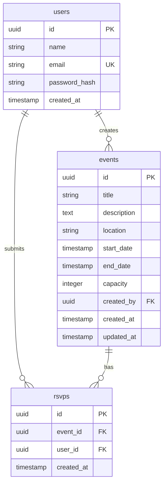

# 🎉 Events API

A small, focused, secure **Events Management REST API** built with NestJS,
JavaScript (CommonJS), PostgreSQL, Sequelize, JWT, and Swagger.

It is intentionally scoped to an MVP: registration, login, JWT-protected event
CRUD with ownership rules, RSVP with capacity and duplicate protection, and an
attendees endpoint.

The JWT token lifetime is controlled by the `JWT_EXPIRES_IN` environment variable
(default: `1h`).

---

## 🛠️ Tech Stack

| Concern        | Choice                                  |
| -------------- | --------------------------------------- |
| Runtime        | Node.js + **JavaScript / CommonJS**     |
| Framework      | **NestJS 10** (with legacy decorators)  |
| HTTP           | Express (Nest default)                  |
| Database       | **PostgreSQL**                          |
| ORM            | **Sequelize 6** (`sequelize-cli`)       |
| Auth           | **JWT** via `@nestjs/jwt` + Passport    |
| Password hash  | **bcrypt**                              |
| Validation     | `class-validator` + `class-transformer` |
| Docs           | **Swagger / OpenAPI** (`/api/docs`)     |
| Migrations     | Sequelize CLI                           |
| Testing        | **Jest** + `babel-jest`                |

> **📝 No TypeScript.** All sources are `.js` files using `require` / `module.exports`.

---

## 🚀 Quick Start

### 1️⃣ Install dependencies

```bash
npm install
```

### 2️⃣ Configure environment variables

Copy `.env.example` to `.env`:

```bash
cp .env.example .env
```

> ⚠️ **Never commit `.env`** — it's already in `.gitignore`.

### 3️⃣ Set up the PostgreSQL database

Create the `events_db` database using your preferred method:

**Option A — Using `psql` CLI:**
```sql
CREATE DATABASE events_db;
```

**Option B — Using `sequelize-cli`:**
```bash
npm run db:create
```

### 4️⃣ Run migrations

```bash
npm run db:migrate
```

This creates three tables in order:

1. 📋 `users` — user accounts
2. 📅 `events` — event records
3. 🎟️ `rsvps` — event RSVPs/attendances

To **undo all migrations** (drop all tables):

```bash
npm run db:migrate:undo
```

### 5️⃣ Start the application

```bash
# 🧑‍💻 Development mode (auto-reload)
npm run start
# or
npm run start:dev

# 🔨 Production mode (requires build first)
npm run build
npm run start:prod
```

The API is available at `http://localhost:3000`. No sensitive data is logged.

---

## 📚 API Documentation

### 🔷 Swagger UI

Interactive API docs with "Try it out" support:

```
http://localhost:3000/api/docs
```

### 🔶 OpenAPI JSON

Machine-readable spec:

```
http://localhost:3000/api/docs-json
```

### 🔐 Using JWT in Swagger

1. Register or login via the endpoints
2. Copy the `accessToken` from the response
3. Click the **Authorize** 🔒 button at the top
4. Paste: `Bearer <your_token>`
5. Test protected endpoints directly!

---

## 🛣️ API Endpoints

### 🔐 Authentication

| Method | Path               | Auth | Description                     |
| ------ | ------------------ | ---- | ------------------------------- |
| POST   | `/auth/register`   | —    | Register a new user account     |
| POST   | `/auth/login`      | —    | Login and receive JWT token     |

### 📅 Events

| Method | Path                 | Auth | Description                          |
| ------ | -------------------- | ---- | ------------------------------------ |
| POST   | `/events`            | JWT  | Create a new event                   |
| GET    | `/events`            | —    | List all public events               |
| GET    | `/events/:id`        | —    | Get a single event by ID             |
| PATCH  | `/events/:id`        | JWT  | Update an event (owner only)         |
| DELETE | `/events/:id`        | JWT  | Delete an event (owner only)          |

### 🎟️ RSVPs

| Method | Path                   | Auth | Description                        |
| ------ | ---------------------- | ---- | ---------------------------------- |
| POST   | `/events/:id/rsvp`     | JWT  | RSVP / join an event               |
| GET    | `/events/:id/attendees`| JWT  | List all attendees for an event    |

### 📊 HTTP Status Codes

| Code | Meaning                                                                |
| ---- | ---------------------------------------------------------------------- |
| 200  | ✅ OK / standard success                                               |
| 201  | 🆕 Resource created successfully                                       |
| 204  | 🗑️ Resource deleted (no body)                                          |
| 400  | ❌ Validation failed or business rule violated (e.g., `endDate <= startDate`) |
| 401  | 🔒 Missing / invalid / expired JWT token                              |
| 403  | 🚫 Authenticated user is not the event owner                           |
| 404  | 🔍 Resource (event) not found                                         |
| 409  | ⚠️ Conflict — duplicate email, duplicate RSVP, or event at capacity   |

---

## 💾 Data Model

### Entity Relationship Diagram

```
┌──────────┐ 1     * ┌──────────┐ 1     * ┌──────────┐
│  users   │─────────│  events  │─────────│  rsvps   │
└──────────┘         └──────────┘         └──────────┘
     │                                        ▲
     │              1                      * │
     └────────────────────────────────────────┘
```

### Key Relationships

- 👤 **User → Events** — A user can create zero or more events (`events.created_by` → `users.id`)
- 📅 **Event → RSVPs** — An event can have zero or more RSVPs (`rsvps.event_id` → `events.id`)
- 👤 **User → RSVPs** — A user can have zero or more RSVPs (`rsvps.user_id` → `users.id`)

### Database Constraints

- 📧 `users.email` is **UNIQUE** — no duplicate accounts
- 🎟️ `rsvps(event_id, user_id)` is **UNIQUE** — a user can RSVP at most once per event
- 📊 `events.capacity` has a CHECK constraint `> 0` — must be positive
- 🗑️ All FK relationships use `ON DELETE CASCADE`

### Mermaid ER Diagram



---

## 🔐 Authentication Flow

```
┌──────────────┐                          ┌──────────────┐
│   Client     │                          │  Events API  │
└──────┬───────┘                          └──────┬───────┘
       │  POST /auth/register                  │
       │  { name, email, password }            │
       │ ─────────────────────────────────────►│
       │                                       │ hash + create user
       │                                       │ sign JWT
       │  201 { accessToken, user }            │
       │ ◄─────────────────────────────────────│
       │                                       │
       │  POST /auth/login                     │
       │  { email, password }                  │
       │ ─────────────────────────────────────►│
       │  200 { accessToken, user }           │
       │ ◄─────────────────────────────────────│
       │                                       │
       │  POST /events                          │
       │  Authorization: Bearer <JWT>         │
       │ ─────────────────────────────────────►│
       │                                       │ verify JWT
       │                                       │ createdBy := jwt.sub
       │  201 EventResponse                   │
       │ ◄─────────────────────────────────────│
```

### 🔑 Key Points

- Identity for authenticated operations is **always** derived from the JWT (`request.user.id`)
- Client-supplied user identifiers in the request body are **ignored**
- JWT tokens expire after `JWT_EXPIRES_IN` duration (default: `1h`)

---

## 📁 Project Structure

```
src/
├── auth/
│   ├── auth.controller.js         # Auth endpoints (register, login)
│   ├── auth.module.js
│   ├── auth.service.js            # JWT signing, password hashing
│   ├── auth.service.spec.js       # Auth unit tests
│   ├── decorators/
│   │   └── current-user.decorator.js
│   ├── dto/
│   │   ├── auth-response.dto.js
│   │   ├── login.dto.js
│   │   └── register.dto.js
│   ├── guards/
│   │   └── jwt-auth.guard.js      # JWT protection
│   └── strategies/
│       └── jwt.strategy.js         # Passport JWT strategy
├── users/
│   ├── users.module.js
│   └── users.service.js            # User CRUD operations
├── events/
│   ├── events.controller.js        # Event CRUD endpoints
│   ├── events.module.js
│   ├── events.service.js           # Event business logic
│   ├── events.service.spec.js     # Event unit tests
│   └── dto/
│       ├── create-event.dto.js
│       ├── event-response.dto.js
│       └── update-event.dto.js
├── rsvp/
│   ├── rsvp.controller.js         # RSVP endpoints
│   ├── rsvp.module.js
│   ├── rsvp.service.js             # RSVP business logic
│   ├── rsvp.service.spec.js        # RSVP unit tests
│   └── dto/
│       └── attendee.dto.js
├── database/
│   ├── config/
│   │   └── config.js               # Sequelize config from env
│   ├── database.module.js
│   ├── migrations/
│   │   ├── 20260101000001-create-users.js
│   │   ├── 20260101000002-create-events.js
│   │   └── 20260101000003-create-rsvps.js
│   └── models/
│       ├── event.model.js
│       ├── index.js                # Model associations
│       ├── rsvp.model.js
│       └── user.model.js
├── app.module.js
└── main.js                         # Bootstrap + Swagger setup
```

> 💡 **Design Note** — Models live under `src/database/models/` rather than
> spread across feature modules. This keeps the data layer centralized and
> avoids circular imports between modules that all need User / Event / Rsvp.

---

## ✅ RSVP Concurrency Protection

`POST /events/:id/rsvp` uses **pessimistic locking** to prevent race conditions:

```
BEGIN
  SELECT ... FROM events WHERE id = :id FOR UPDATE   -- 🔒 row lock
  SELECT COUNT(*) FROM rsvps WHERE event_id = :id   -- count current RSVPs
  -- capacity check under lock
  INSERT INTO rsvps (event_id, user_id) VALUES (...) -- ✅ insert
COMMIT
```

This ensures:
- ⚡ Concurrent RSVPs are serialized
- 🎯 Capacity cannot be exceeded
- 🔒 DB-level `UNIQUE(event_id, user_id)` prevents duplicates

---

## 🏠 Ownership Rules

| Operation         | Who can do it?              | Error if not owner |
| ---------------- | --------------------------- | ------------------ |
| Update event     | Event owner only            | `403 Forbidden`    |
| Delete event     | Event owner only            | `403 Forbidden`    |
| Create event     | Any authenticated user      | —                  |
| View events      | Anyone (no auth required)   | —                  |
| RSVP to event    | Any authenticated user      | —                  |
| View attendees   | Any authenticated user      | —                  |

Ownership checks live in the **service layer**, not the controller, so they can't be bypassed.

---

## 🧪 Testing

Run the full test suite:

```bash
npm test
```

### Test Coverage

| Test File              | What's Tested                                    |
| ---------------------- | ------------------------------------------------ |
| `auth.service.spec.js` | Registration, login, duplicate email, no password hash in responses |
| `events.service.spec.js` | Create with JWT owner, ownership enforcement, 404, date validation, attendee count |
| `rsvp.service.spec.js` | Happy path, missing event, duplicate RSVP, capacity limits, DB constraint errors |

> 💡 Tests use Jest with `babel-jest` and mock the database — no external PostgreSQL needed!

---

## ⚙️ Configuration Reference

| Variable              | Required | Default       | Description                                |
| --------------------- | -------- | ------------- | ------------------------------------------ |
| `NODE_ENV`            | No       | `development` | Runtime environment                        |
| `PORT`                | No       | `3000`        | HTTP port                                  |
| `DATABASE_HOST`       | Yes      | —             | PostgreSQL host                            |
| `DATABASE_PORT`       | Yes      | `5432`        | PostgreSQL port                            |
| `DATABASE_NAME`       | Yes      | —             | Database name                              |
| `DATABASE_USER`       | Yes      | —             | Database user                              |
| `DATABASE_PASSWORD`   | Yes      | —             | Database password                          |
| `DATABASE_LOGGING`    | No       | `false`       | Enable SQL logging (`true` / `false`)      |
| `JWT_SECRET`          | Yes      | —             | JWT signing secret (use a long random string) |
| `JWT_EXPIRES_IN`      | No       | `1h`          | JWT lifetime (e.g., `15m`, `1h`, `7d`)    |
| `BCRYPT_SALT_ROUNDS`  | No       | `10`          | bcrypt cost factor                         |

---

## 🔒 Security Notes

### Implemented ✅

- **bcrypt** password hashing with configurable salt rounds
- **JWT** bearer token authentication
- **Sequelize parameterized queries** — no SQL injection
- **class-validator** request validation
- Password hash **never returned** in API responses
- Ownership checks prevent unauthorized event modifications

### Production Recommendations 🔧

- Use a **strong, random** `JWT_SECRET` (32+ characters)
- Enable **HTTPS** in production
- Use a **managed PostgreSQL** instance (AWS RDS, Supabase, etc.)
- Set `DATABASE_LOGGING=false` in production
- Consider **rate limiting** for auth endpoints
- Add **CORS** configuration if serving a frontend

---

## 📦 Out of Scope (Deliberately Omitted)

This MVP intentionally does **not** include:

- 🖥️ Frontend / admin dashboard
- 👥 Roles & permissions (only "owner vs everyone else")
- 📧 Email / push notifications
- 🔍 Search, advanced filtering, pagination
- 🗄️ Redis caching, message queues, microservices
- 📁 File uploads / image storage
- 💳 Payment processing
- 🔑 Social login (Google, GitHub, etc.)
- 📊 Distributed tracing / monitoring (Prometheus, ELK)

---

## 🎯 API Request/Response Examples

### Register a User

```http
POST /auth/register
Content-Type: application/json

{
  "name": "Alice Johnson",
  "email": "alice@example.com",
  "password": "SecurePass123!"
}
```

**Response (201 Created):**
```json
{
  "accessToken": "eyJhbGciOiJIUzI1NiIsInR5cCI6IkpXVCJ9...",
  "user": {
    "id": "550e8400-e29b-41d4-a716-446655440000",
    "name": "Alice Johnson",
    "email": "alice@example.com"
  }
}
```

### Login

```http
POST /auth/login
Content-Type: application/json

{
  "email": "alice@example.com",
  "password": "SecurePass123!"
}
```

**Response (200 OK):**
```json
{
  "accessToken": "eyJhbGciOiJIUzI1NiIsInR5cCI6IkpXVCJ9...",
  "user": {
    "id": "550e8400-e29b-41d4-a716-446655440000",
    "name": "Alice Johnson",
    "email": "alice@example.com"
  }
}
```

### Create an Event

```http
POST /events
Authorization: Bearer <JWT_TOKEN>
Content-Type: application/json

{
  "title": "Tech Conference 2026",
  "description": "Annual technology conference with keynote speakers",
  "location": "Convention Center, San Francisco",
  "startDate": "2026-06-15T09:00:00Z",
  "endDate": "2026-06-15T18:00:00Z",
  "capacity": 500
}
```

**Response (201 Created):**
```json
{
  "id": "660e8400-e29b-41d4-a716-446655440001",
  "title": "Tech Conference 2026",
  "description": "Annual technology conference with keynote speakers",
  "location": "Convention Center, San Francisco",
  "startDate": "2026-06-15T09:00:00.000Z",
  "endDate": "2026-06-15T18:00:00.000Z",
  "capacity": 500,
  "attendeeCount": 0,
  "createdBy": "550e8400-e29b-41d4-a716-446655440000",
  "createdAt": "2026-01-01T00:00:00.000Z",
  "updatedAt": "2026-01-01T00:00:00.000Z"
}
```

### RSVP to an Event

```http
POST /events/660e8400-e29b-41d4-a716-446655440001/rsvp
Authorization: Bearer <JWT_TOKEN>
```

**Response (201 Created):**
```json
{
  "id": "770e8400-e29b-41d4-a716-446655440002",
  "eventId": "660e8400-e29b-41d4-a716-446655440001",
  "userId": "550e8400-e29b-41d4-a716-446655440000",
  "createdAt": "2026-01-01T00:00:00.000Z"
}
```

### Get Event Attendees

```http
GET /events/660e8400-e29b-41d4-a716-446655440001/attendees
Authorization: Bearer <JWT_TOKEN>
```

**Response (200 OK):**
```json
[
  {
    "id": "550e8400-e29b-41d4-a716-446655440000",
    "name": "Alice Johnson",
    "email": "alice@example.com",
    "createdAt": "2026-01-01T00:00:00.000Z"
  }
]
```

---

## 📞 Need Help?

1. Check the **Swagger UI** at `http://localhost:3000/api/docs`
2. Review the **Configuration Reference** above
3. Inspect the **source code** in `src/` for implementation details

Happy coding! 🚀
