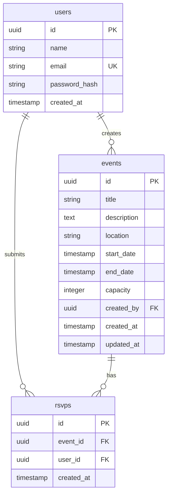

# Events API

A small, focused, secure **Events Management REST API** built with NestJS,
JavaScript (CommonJS), PostgreSQL, Sequelize, JWT, and Swagger.

It is intentionally scoped to an MVP: registration, login, JWT-protected event
CRUD with ownership rules, RSVP with capacity and duplicate protection, and an
attendees endpoint.

---

## Tech Stack

| Concern        | Choice                                  |
| -------------- | --------------------------------------- |
| Runtime        | Node.js + **JavaScript / CommonJS**     |
| Framework      | **NestJS 10** (with legacy decorators)  |
| HTTP           | Express (Nest default)                  |
| Database       | **PostgreSQL**                          |
| ORM            | **Sequelize 6** (`sequelize-cli`)       |
| Auth           | **JWT** via `@nestjs/jwt` + Passport    |
| Password hash  | **bcrypt**                              |
| Validation     | `class-validator` + `class-transformer` |
| Docs           | **Swagger / OpenAPI** (`/api/docs`)     |
| Migrations     | Sequelize CLI                           |

> **No TypeScript.** All sources are `.js` files using `require` / `module.exports`.

---

## Setup

### 1. Install dependencies

```bash
npm install
```

### 2. Configure environment variables

Copy `.env.example` to `.env` and edit values:

```bash
cp .env.example .env
```

The most important variables are:

```env
NODE_ENV=development
PORT=3000

DATABASE_HOST=localhost
DATABASE_PORT=5432
DATABASE_NAME=events_db
DATABASE_USER=postgres
DATABASE_PASSWORD=postgres
DATABASE_LOGGING=false

JWT_SECRET=replace-with-a-long-random-string
JWT_EXPIRES_IN=1h

BCRYPT_SALT_ROUNDS=10
```

> Never commit `.env`. The `.gitignore` already excludes it.

### 3. Create the PostgreSQL database

Either use your favourite client (`psql`, pgAdmin, etc.):

```sql
CREATE DATABASE events_db;
```

…or use the bundled `sequelize-cli`:

```bash
npm run db:create
```

### 4. Run migrations

```bash
npm run db:migrate
```

This applies, in order:

1. `20260101000001-create-users.js`
2. `20260101000002-create-events.js`
3. `20260101000003-create-rsvps.js`

To undo all migrations:

```bash
npm run db:migrate:undo
```

### 5. Start the application

```bash
# Development (Babel on-the-fly transpile)
npm run start

# Or the explicit dev alias
npm run start:dev
```

Production build (optional):

```bash
npm run build
npm run start:prod
```

The API listens on `http://localhost:3000` by default. Logs use the Nest
default logger and contain no sensitive data.

---

## API Documentation

Swagger UI:

```
http://localhost:3000/api/docs
```

OpenAPI JSON:

```
http://localhost:3000/api/docs-json
```

The Swagger UI is wired with a JWT Bearer scheme — use the **Authorize**
button at the top to paste a token from `/auth/login` and try protected
routes directly.

---

## API Endpoints

| Method | Path                            | Auth | Description                         |
| ------ | ------------------------------- | ---- | ----------------------------------- |
| POST   | `/auth/register`                | —    | Register a new user                 |
| POST   | `/auth/login`                   | —    | Log in and obtain a JWT             |
| POST   | `/events`                       | JWT  | Create an event                     |
| GET    | `/events`                       | —    | List all events                     |
| GET    | `/events/:id`                   | —    | Get a single event                  |
| PATCH  | `/events/:id`                   | JWT  | Update an event you own             |
| DELETE | `/events/:id`                   | JWT  | Delete an event you own             |
| POST   | `/events/:id/rsvp`              | JWT  | RSVP (join) an event                |
| GET    | `/events/:id/attendees`         | JWT  | List the attendees of an event      |

### HTTP status codes

| Code | Meaning                                                                  |
| ---- | ------------------------------------------------------------------------ |
| 200  | OK / standard success                                                    |
| 201  | Resource created                                                         |
| 204  | Resource deleted                                                         |
| 400  | Validation failed or business invariant violated (e.g. `endDate <= startDate`) |
| 401  | Missing / invalid / expired JWT                                          |
| 403  | Authenticated user is not the event owner                                |
| 404  | Resource (event) does not exist                                          |
| 409  | Conflict — duplicate email, duplicate RSVP, or event at capacity         |

---

## Data Model

```
┌──────────┐ 1     * ┌──────────┐ 1     * ┌──────────┐
│  users   │─────────│  events  │─────────│  rsvps   │
└──────────┘         └──────────┘         └──────────┘
     │                                        ▲
     │              1                      * │
     └────────────────────────────────────────┘
```

* A `User` owns zero or more `Event`s (`events.created_by` → `users.id`).
* An `Event` has zero or more `RSVP`s (`rsvps.event_id` → `events.id`).
* A `User` has zero or more `RSVP`s (`rsvps.user_id` → `users.id`).
* `users.email` is **UNIQUE**.
* `rsvps(event_id, user_id)` is **UNIQUE** (a user can RSVP at most once per event).
* `events.capacity` has a CHECK constraint `> 0`.
* FK relationships use `ON DELETE CASCADE`.

### Mermaid ER diagram



---

## Authentication Flow

```
┌──────────────┐                          ┌──────────────┐
│   Client     │                          │  Events API  │
└──────┬───────┘                          └──────┬───────┘
       │  POST /auth/register                  │
       │  { name, email, password }            │
       │ ─────────────────────────────────────►│
       │                                       │ hash + create user
       │                                       │ sign JWT
       │  201 { accessToken, user }            │
       │ ◄─────────────────────────────────────│
       │                                       │
       │  POST /auth/login                     │
       │  { email, password }                  │
       │ ─────────────────────────────────────►│
       │  200 { accessToken, user }            │
       │ ◄─────────────────────────────────────│
       │                                       │
       │  POST /events                         │
       │  Authorization: Bearer <JWT>          │
       │ ─────────────────────────────────────►│
       │                                       │ verify JWT
       │                                       │ createdBy := jwt.sub
       │  201 EventResponse                    │
       │ ◄─────────────────────────────────────│
```

Identity for authenticated operations is **always** derived from the JWT
(`request.user.id`). Client-supplied user identifiers in the request body are
ignored.

---

## Project Structure

```
src/
├── auth/
│   ├── auth.controller.js
│   ├── auth.module.js
│   ├── auth.service.js
│   ├── auth.service.spec.js
│   ├── decorators/
│   │   └── current-user.decorator.js
│   ├── dto/
│   │   ├── auth-response.dto.js
│   │   ├── login.dto.js
│   │   └── register.dto.js
│   ├── guards/
│   │   └── jwt-auth.guard.js
│   └── strategies/
│       └── jwt.strategy.js
├── users/
│   ├── users.module.js
│   └── users.service.js
├── events/
│   ├── events.controller.js
│   ├── events.module.js
│   ├── events.service.js
│   ├── events.service.spec.js
│   └── dto/
│       ├── create-event.dto.js
│       ├── event-response.dto.js
│       └── update-event.dto.js
├── rsvp/
│   ├── rsvp.controller.js
│   ├── rsvp.module.js
│   ├── rsvp.service.js
│   ├── rsvp.service.spec.js
│   └── dto/
│       └── attendee.dto.js
├── database/
│   ├── config/
│   │   └── config.js
│   ├── database.module.js
│   ├── migrations/
│   │   ├── 20260101000001-create-users.js
│   │   ├── 20260101000002-create-events.js
│   │   └── 20260101000003-create-rsvps.js
│   └── models/
│       ├── event.model.js
│       ├── index.js
│       ├── rsvp.model.js
│       └── user.model.js
├── app.module.js
└── main.js
```

> **Design note** — models live under `src/database/models/` rather than
> spread across each feature module. That keeps the data layer (models,
> migrations, config) in one place and avoids circular imports between
> feature modules that all need the User / Event / Rsvp classes.

---

## Reliability Notes

### RSVP concurrency

`POST /events/:id/rsvp` performs:

```
BEGIN
  SELECT ... FROM events WHERE id = :id FOR UPDATE   -- row lock
  (pre-check duplicate RSVP under lock)
  SELECT COUNT(*) FROM rsvps WHERE event_id = :id
  (check capacity under lock)
  INSERT INTO rsvps (event_id, user_id) VALUES (...)
COMMIT
```

This serialises concurrent RSVPs against the same event so capacity cannot be
exceeded. The DB-level `UNIQUE(event_id, user_id)` constraint is the final
safety net against duplicates even if any application-level check is bypassed.

### Ownership

Update and delete operations are guarded by `event.createdBy === requester.id`.
A failed check returns `403 Forbidden`. The check is performed inside the
service (not the controller) so it cannot be skipped by an alternative HTTP
surface.

### Password storage

Passwords are stored as **bcrypt** hashes with `BCRYPT_SALT_ROUNDS` rounds.
The `passwordHash` field is never returned by the API and never logged.

---

## Testing

Unit tests focus on the business-critical behaviour:

```bash
npm test
```

Current coverage:

* `auth.service.spec.js` — registration, login, duplicate email, no passwordHash in responses.
* `events.service.spec.js` — create with JWT-derived owner, ownership on update/delete, 404, endDate validation, attendee count.
* `rsvp.service.spec.js` — happy path, missing event, duplicate RSVP, capacity enforcement, DB UNIQUE mapped to 409, attendee projection.

Tests use Jest with `babel-jest` so the same decorator / class-field syntax
that runs the app also runs in tests. No external DB is required for the
unit suite.

---

## Configuration Reference

| Variable              | Required | Default       | Description                                |
| --------------------- | -------- | ------------- | ------------------------------------------ |
| `NODE_ENV`            | no       | `development` | Runtime environment                        |
| `PORT`                | no       | `3000`        | HTTP port                                  |
| `DATABASE_HOST`       | yes      | —             | PostgreSQL host                            |
| `DATABASE_PORT`       | yes      | `5432`        | PostgreSQL port                            |
| `DATABASE_NAME`       | yes      | —             | Database name                              |
| `DATABASE_USER`       | yes      | —             | Database user                              |
| `DATABASE_PASSWORD`   | yes      | —             | Database password                          |
| `DATABASE_LOGGING`    | no       | `false`       | Set `true` to log SQL                      |
| `JWT_SECRET`          | yes      | —             | JWT signing secret                         |
| `JWT_EXPIRES_IN`      | no       | `1h`          | JWT lifetime (e.g. `15m`, `1h`, `7d`)     |
| `BCRYPT_SALT_ROUNDS`  | no       | `10`          | Cost factor for bcrypt                     |

---

## Out of Scope (Deliberately)

The MVP intentionally does not include:

* Frontend / admin dashboard
* Roles & permissions (only "owner vs everyone else")
* Email / push notifications
* Search, advanced filtering, pagination
* Caching layer (Redis), queues, microservices
* File uploads
* Payments, social login
* Distributed tracing / ELK / Prometheus
